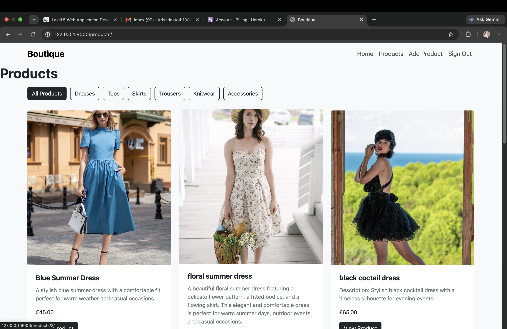

# Boutique Ado

## Introduction

Boutique Ado is an e-commerce website built with Django. The project allows users to browse products and view product details. Products can be managed through the website by authorised users, as well as through the Django administration panel.
This project was created as part of my Level 5 Web Application Development course.

## Features

- Responsive design for different screen sizes
- Product listing functionality
- Product detail pages
- Django admin panel for managing products
- Product images, descriptions and prices
 -User registration and authentication
 -Product category filtering
 -Create, read, update and delete (CRUD) product functionality
 -Restricted product management for authorised users

## JavaScript

Custom JavaScript is used to improve the user experience.

A confirmation dialog is shown before a product is deleted. If the user cancels the confirmation, the delete request is stopped before the form is submitted.

## Technologies Used

- HTML5
- CSS3
- JavaScript
- Python
- Django
- SQLite database
- Git and GitHub

## Database

The project uses Django models to store product information.

The Product model contains:

- Product name
- Product description
- Product price
- Product image

## Products

Current products added:

- Straw Summer Hat
- Leather Handbag
- High Waist Denim Jeans
- Beige Summer Skirt
- Cream Knit Sweater
- Blue Casual Blouse
- Black Cocktail Dress
- White Evening Dress
- Floral Summer Dress
- Blue Summer Dress

### Category Model

The Category model stores the categories used to organise products.

It contains:

- Category name

### Database Relationship

The Product and Category models have a one-to-many relationship.

Each product can belong to one category, while each category can contain multiple products. This relationship is implemented using a Django ForeignKey in the Product model.

If a category is deleted, the products belonging to that category are not deleted. Instead, their category value is set to NULL.

This structure allows products to be organised and filtered by category.

## Image Credits

Product images were sourced from free image websites.

- Blue Summer Dress image:
  Elegant blue summer dress for a stylish and comfortable look.
  Source: Pexels
  Photographer: Александр Слесарев
  URL: https://www.pexels.com/photo/a-woman-wearing-a-blue-dress-15665840/
  
  White Evening Dress image:
  Classic white evening dress perfect for special occasions.
  Source: Pexels
  Photographer: Huy Nguyễn
  URL : https://www.pexels.com/photo/elegant-woman-in-white-dress-indoors-28673073/

  Floral Summer Dress image:
  Beautiful floral summer dress with a feminine style.
  Source: Pexels
  Photographer : Arthouse Studio
  URL : https://www.pexels.com/photo/woman-in-a-dress-and-a-hat-carrying-a-shopping-basket-4589211/

  Black Cocktail Dress image :
  Elegant black cocktail dress for evening events.
  Source : Pexels
  Photographer :helin öner
  URL : https://www.pexels.com/photo/beautiful-woman-in-a-black-dress-on-a-wooden-door-frame-15006215/

  Cream Knit Sweater image :
  Soft knitted sweater for a cosy everyday outfit.
  Source : Pexels
  Photographer : Polina Tankilevitch
  URL :  https://www.pexels.com/photo/woman-in-white-knit-sweater-covering-her-face-with-her-sweater-6630847/

  Blue Casual Blouse image :
  Lightweight blouse for smart casual looks.
  Source : Pexels
  Photographer : Mâide Arslan
  URL : https://www.pexels.com/photo/young-woman-in-a-blue-shirt-against-a-stone-wall-20636650/

  High Waist Denim Jeans image :
  High Waist Denim Jeans
  Source :Pexels
  Photographer : Thirdman
  URL : https://www.pexels.com/photo/person-in-black-long-sleeve-shirt-with-hand-in-pocket-8053690/

  Beige Summer Skirt image:
  Lightweight skirt for warm weather.
  Source:Pexels
  Photographer:Patricia Bozan
  URL : https://www.pexels.com/photo/stylish-young-woman-standing-against-urban-wall-36625478/

  Straw Summer Hat image:
  Summer accessory to complete an outfit.
  Source:Pexels
  Photographer:hello aesthe
  URL: https://www.pexels.com/photo/close-up-of-a-hat-by-a-swimming-pool-25524555/

  Leather Handbag image:
  Elegant handbag for everyday use.
  Source:Pexels
  Photographer:Diana Light
  URL:https://www.pexels.com/photo/stylish-handbag-on-stool-in-light-room-4830924/

All images are used for educational purposes as part of this student project.

- Bootstrap: Used for responsive layout and interface components
- django-allauth: Used for user registration and authentication
External libraries and frameworks are used according to their respective documentation. Custom application logic, templates and styling were developed for this student project.

## Development Notes

Products are created and managed through the Django administration interface.

The administrator can add, edit and remove products without directly changing the database.

## Local Development

Clone this repository:

git clone  https://github.com/Krisztina-sketch/boutique_ado_v1.git

Install requirements:

pip install -r requirements.txt

Run migrations:

python manage.py migrate

Start the server:

python manage.py runserver

## Credits

- Images: Pexels
- Framework: Django
- Programming language: Python
- Database: SQLite

## Testing

The website was tested throughout development to make sure the main features work correctly.

## Bugs and Fixes

Several issues were identified and resolved during development.

### Django Allauth Configuration

While configuring django-allauth, authentication settings and URL configuration needed to be adjusted so that sign in and sign out worked correctly.

The issue was resolved by adding the required allauth applications, authentication backend, site configuration and account URLs.

### Product CRUD Indentation Errors

During development of the add, edit and delete product views, Python indentation errors occurred.

These were resolved by correcting the indentation of the view functions and checking the application using:

`python manage.py check`

After the fixes, Django reported:

`System check identified no issues (0 silenced).`

### Static CSS File Not Found

The custom stylesheet initially returned a 404 error because the static file structure was not configured correctly.

The issue was resolved by creating the correct static directory structure and loading the stylesheet using Django's static template tag.

After the fix, the stylesheet loaded successfully with a 200 response.

### Authentication and Product Management

Initially, product management pages were accessible without appropriate navigation restrictions.

This was improved by using `@login_required` on the add, edit and delete product views and by conditionally displaying management links based on authentication status.

### Duplicate Test Products

Temporary products were created while testing CRUD functionality.

These test products were later removed through Django Admin so that the final product catalogue contained only the intended products.

### Secret Key Security

The Django SECRET_KEY was initially stored directly in `settings.py`.

This was corrected by moving the secret key to an environment variable so that it is not included directly in the repository.

### Remaining Issues

The application is still awaiting final Heroku deployment and live production testing.

No major known local-development issues currently prevent the core functionality from working.

### Navigation

- Checked that the Home link works correctly.
- Checked that the Products link opens the product catalogue.
- Checked that the Add Product link opens the product management form for an authorised user.
- Checked that Sign In and Sign Out work correctly.

### Product Display

- Checked that products stored in the database appear on the Products page.
- Checked that product names, descriptions, prices and images display correctly.
- Checked that the View Product button opens the correct product detail page.
- Checked that products can be filtered using the category buttons.

### Product Management

The CRUD functionality was manually tested.

- **Create:** Added new products using the Add Product form and confirmed that they appeared on the Products page.
- **Read:** Checked that products can be viewed on the Products page and individual product detail pages.
- **Update:** Edited an existing product and confirmed that the updated information appeared correctly.
- **Delete:** Deleted a product and confirmed that it was removed from the product catalogue.

### Authentication

- Tested user sign in.
- Tested user sign out.
- Checked that navigation changes depending on whether the user is authenticated.
- Checked access to product management functionality.

## Security

Security considerations have been included throughout the development of Boutique Ado.

- Django's authentication system is used for user registration, sign in and sign out.
- Product management functionality requires authentication.
- Django's CSRF protection is used on forms that modify data.
- The Django SECRET_KEY is stored as an environment variable rather than being hard-coded in the repository.
- DEBUG is configured through an environment variable and will be disabled in the production environment.
- Environment variables are used to keep sensitive configuration information out of the GitHub repository.
- Django's built-in password validation is used for user passwords.

### Django Admin

The Django administration panel was used to check and manage database records, users, email addresses, products and categories.

### Images

Product images were checked to make sure that they display correctly with the appropriate products.

### Responsive Design

The website was tested at different screen sizes to check that the layout remains usable and readable.
## Repository

GitHub: [boutique_ado_v1](https://github.com/Krisztina-sketch/boutique_ado_v1)

## User Authentication

The website includes user authentication using Django's built-in authentication system.

Users can:

- Create an account
- Sign in
- Sign out
- Access features according to their authentication status

Product management functionality is restricted so that unauthorised users cannot modify products.

## Product Management

Authorised users can manage products directly through the website.

The following CRUD functionality has been implemented:

- Create new products
- Read and view product information
- Update existing products
- Delete products

Product forms allow information such as the product name, description, price, category and image to be managed.

Confirmation is required before a product is deleted.

## Responsive Design

The website was designed to work across different screen sizes.

Bootstrap and custom CSS were used to create a responsive layout. The navigation, product catalogue and product detail pages adapt to different screen sizes.

## Known Issues

At the time of development, no major known issues prevent the core functionality of the website from working.

Further improvements could include:

- Improved product filtering and searching
- Additional user profile functionality
- Shopping basket and checkout functionality
- Improved image storage for production deployment

## Deployment

The project is prepared for deployment to Heroku.

Deployment requirements include:

- `requirements.txt` containing the Python dependencies
- `Procfile` containing the Gunicorn web process
- Gunicorn as the production web server

The Procfile contains:

`web: gunicorn boutique_ado.wsgi`

The final deployed application URL will be added here after deployment.

## Version Control

Git and GitHub were used for version control throughout development.

Changes were committed regularly during development and pushed to the GitHub repository.

Repository:

[boutique_ado_v1](https://github.com/Krisztina-sketch/boutique_ado_v1)

## Future Features

Possible future improvements include:

- Shopping basket functionality
- Online checkout and payments
- Product search
- Product filtering
- User profiles
- Product reviews
- Wishlist functionality
- Improved product image management

## Wireframes

Wireframes were created during the planning stage of Boutique Ado to establish the structure and layout of the main pages before development.

The wireframes include:

- Home page
- Products page
- Product detail page

The final application follows the core structure of these wireframes, although some design elements and functionality were adapted during development.

## AI Assistance

Generative AI tools, including ChatGPT by OpenAI, were used during development for guidance, troubleshooting, code explanation, debugging support and assistance with project documentation.

AI was also used to assist with the creation of wireframe concepts for the Boutique Ado project. The generated material was reviewed and adapted for use within the project.

All final implementation decisions, testing and project submission remain the responsibility of the developer.

## Deployment

The Boutique Ado application is deployed using Render.

Live site:

https://boutique-ado-v1-l5w5.onrender.com

The project is connected to the GitHub repository and Render automatically deploys changes pushed to the main branch.

### Deployment configuration

- Runtime: Python 3.10.19
- Build command:

  `pip install -r requirements.txt && python manage.py collectstatic --noinput`

- Start command:

  `gunicorn boutique_ado.wsgi`

- Static files are handled using WhiteNoise.
- Environment variables are configured securely in Render.
