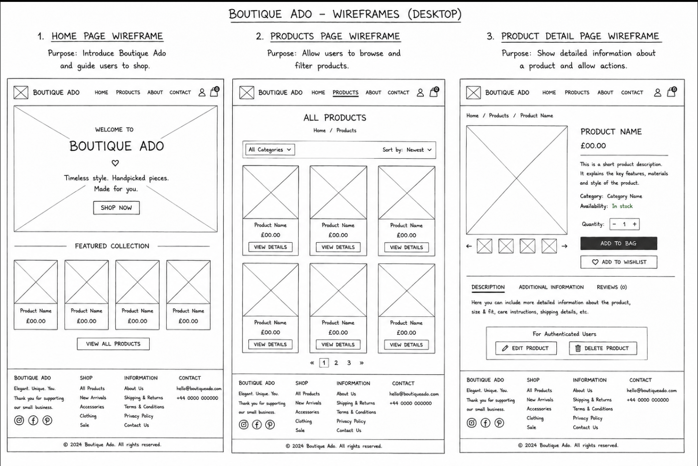

# Boutique Ado

## Introduction

Boutique Ado is an e-commerce website built with Django. The project allows users to browse products and view product details. Products can be managed through the website by authorised users, as well as through the Django administration panel.
This project was created as part of my Level 5 Web Application Development course.

## Features

- Responsive design for different screen sizes
- Product listing functionality
- Product detail pages
- Django admin panel for managing products
- Product images, descriptions and prices
 -User registration and authentication
 -Product category filtering
 -Create, read, update and delete (CRUD) product functionality
 -Restricted product management for authorised users

## JavaScript

Custom JavaScript is used to improve the user experience.

A confirmation dialog is shown before a product is deleted. If the user cancels the confirmation, the delete request is stopped before the form is submitted.

## Technologies Used

- HTML5
- CSS3
- JavaScript
- Python
- Django
- SQLite database
- Git and GitHub

## Database

The project uses Django models to store product information.

The Product model contains:

- Product name
- Product description
- Product price
- Product image

## Products

Current products added:

- Straw Summer Hat
- Leather Handbag
- High Waist Denim Jeans
- Beige Summer Skirt
- Cream Knit Sweater
- Blue Casual Blouse
- Black Cocktail Dress
- White Evening Dress
- Floral Summer Dress
- Blue Summer Dress

### Category Model

The Category model stores the categories used to organise products.

It contains:

- Category name

### Database Relationship

The Product and Category models have a one-to-many relationship.

Each product can belong to one category, while each category can contain multiple products. This relationship is implemented using a Django ForeignKey in the Product model.

If a category is deleted, the products belonging to that category are not deleted. Instead, their category value is set to NULL.

This structure allows products to be organised and filtered by category.

## Image Credits

Product images were sourced from free image websites.

- Blue Summer Dress image:
  Elegant blue summer dress for a stylish and comfortable look.
  Source: Pexels
  Photographer: Александр Слесарев
  URL: https://www.pexels.com/photo/a-woman-wearing-a-blue-dress-15665840/
  
  White Evening Dress image:
  Classic white evening dress perfect for special occasions.
  Source: Pexels
  Photographer: Huy Nguyễn
  URL : https://www.pexels.com/photo/elegant-woman-in-white-dress-indoors-28673073/

  Floral Summer Dress image:
  Beautiful floral summer dress with a feminine style.
  Source: Pexels
  Photographer : Arthouse Studio
  URL : https://www.pexels.com/photo/woman-in-a-dress-and-a-hat-carrying-a-shopping-basket-4589211/

  Black Cocktail Dress image :
  Elegant black cocktail dress for evening events.
  Source : Pexels
  Photographer :helin öner
  URL : https://www.pexels.com/photo/beautiful-woman-in-a-black-dress-on-a-wooden-door-frame-15006215/

  Cream Knit Sweater image :
  Soft knitted sweater for a cosy everyday outfit.
  Source : Pexels
  Photographer : Polina Tankilevitch
  URL :  https://www.pexels.com/photo/woman-in-white-knit-sweater-covering-her-face-with-her-sweater-6630847/

  Blue Casual Blouse image :
  Lightweight blouse for smart casual looks.
  Source : Pexels
  Photographer : Mâide Arslan
  URL : https://www.pexels.com/photo/young-woman-in-a-blue-shirt-against-a-stone-wall-20636650/

  High Waist Denim Jeans image :
  High Waist Denim Jeans
  Source :Pexels
  Photographer : Thirdman
  URL : https://www.pexels.com/photo/person-in-black-long-sleeve-shirt-with-hand-in-pocket-8053690/

  Beige Summer Skirt image:
  Lightweight skirt for warm weather.
  Source:Pexels
  Photographer:Patricia Bozan
  URL : https://www.pexels.com/photo/stylish-young-woman-standing-against-urban-wall-36625478/

  Straw Summer Hat image:
  Summer accessory to complete an outfit.
  Source:Pexels
  Photographer:hello aesthe
  URL: https://www.pexels.com/photo/close-up-of-a-hat-by-a-swimming-pool-25524555/

  Leather Handbag image:
  Elegant handbag for everyday use.
  Source:Pexels
  Photographer:Diana Light
  URL:https://www.pexels.com/photo/stylish-handbag-on-stool-in-light-room-4830924/

All images are used for educational purposes as part of this student project.

- Bootstrap: Used for responsive layout and interface components
- django-allauth: Used for user registration and authentication
External libraries and frameworks are used according to their respective documentation. Custom application logic, templates and styling were developed for this student project.

Products can be created, viewed, updated and deleted through the website by authorised users.

The Django administration interface can also be used to manage products, categories and user data.
## Local Development

Clone this repository:

git clone  https://github.com/Krisztina-sketch/boutique_ado_v1.git

Install requirements:

pip install -r requirements.txt

Run migrations:

python manage.py migrate

Start the server:

python manage.py runserver

## Credits

- Images: Pexels
- Framework: Django
- Programming language: Python
- Database: SQLite

## Testing

The application was tested manually throughout development and again on the live Render deployment.

### Manual and Automated Testing

Manual testing was used to check the application from a user's perspective, including registration, email verification, login, navigation, product display, category filtering and CRUD functionality.

Automated and validation tools were used to identify code and configuration problems. Python code was checked using `pycodestyle`, and Django configuration was checked using `python manage.py check`.

Manual testing is useful for assessing usability, navigation, responsiveness and user interaction. Automated checks are useful for consistently identifying syntax, style and configuration issues.

### Python PEP8 Validation

Python files were validated using:

`python -m pycodestyle . --exclude=.venv,migrations,staticfiles`

Result:

**No PEP8 errors or warnings were reported.**

Django was also checked using:

`python manage.py check`

Result:

`System check identified no issues (0 silenced).`

### Authentication and Email Verification Testing

| Test | Expected Result | Actual Result | Status |
| --- | --- | --- | --- |
| Register a new user | Account is created | Account created successfully | Pass |
| Submit registration email | Verification email is sent through Gmail SMTP | Verification email received successfully | Pass |
| Confirm email address | Confirmation link activates account | Email confirmation completed successfully | Pass |
| Sign in with verified account | User is authenticated | Login completed successfully | Pass |
| Sign out | User session ends | User signed out successfully | Pass |

Gmail SMTP is configured using environment variables stored securely on Render. The live service was upgraded from the free Render tier because the free tier blocks outbound SMTP connections.

### Product and Database Testing

The database-backed product functionality was tested on the live deployed application.

| CRUD Action | Test | Result |
| --- | --- | --- |
| Create | Added a temporary test product using the Add Product form | Product was stored and displayed successfully |
| Read | Opened the product catalogue and product detail page | Product data displayed correctly |
| Update | Changed the temporary product price from £19.99 to £24.99 | Updated value was saved and displayed |
| Delete | Deleted the temporary test product | Product was removed successfully |

This confirmed that the database and CRUD functionality work through the deployed frontend.

### Navigation and Product Display

- Home page loads successfully.
- Products page loads successfully.
- Category filtering works.
- Product detail pages open correctly.
- Authentication links change according to login state.
- Add Product is available to authenticated users.
- Product names, descriptions and prices display correctly.

### Static and Media Testing

Static homepage images were reorganised into:

`home/static/images/products/`

Django confirmed the static files could be found using `findstatic`.

Uploaded product images use the `media/products/` directory.

### Responsive and Usability Testing

The application was checked at different browser widths to confirm that navigation, product cards, forms and text remain readable and usable on mobile, tablet and desktop-sized screens.

### Development and Deployed Version Testing

The application was tested locally and again on the live Render deployment.

The deployed version was checked for:

- user registration;
- Gmail email verification;
- login and logout;
- product catalogue display;
- category filtering;
- CRUD operations;
- static files;
- database functionality.

The live deployment matched the expected development functionality.

### HTML and CSS Validation

The deployed application was validated using the official W3C validation tools.

#### HTML

The live homepage was checked using the W3C Nu HTML Checker.

Initial validation identified heading hierarchy issues caused by `<h5>` elements skipping heading levels. These headings were corrected to use appropriate `<h2>` and `<h3>` elements while retaining the existing visual styling.

Final result:

**Document checking completed. No errors or warnings to show.**

#### CSS

The deployed stylesheet was checked using the W3C CSS Validation Service:

`/static/css/style.css`

Final result:

**Congratulations! No Error Found.**

This confirms that the final deployed HTML and CSS pass W3C validation.

## Features and Screenshots

### Homepage

The homepage introduces the Boutique ADO store and provides navigation to the main areas of the application.

Main features include:

- responsive navigation;
- product-category links;
- featured product images;
- links to the Products page;
- authentication links depending on login state.

### Products Page

The Products page displays products stored in the database.

Each product card includes:

- product image;
- product name;
- price;
- link to the product detail page.

Products can also be filtered by category.

### User Registration

Users can create a new account using the django-allauth registration form.

Registration requires:

- username;
- email address;
- email confirmation;
- password;
- password confirmation.

A verification email is sent after registration.

### Email Verification

New users receive a real verification email through Gmail SMTP.

The confirmation link directs the user back to the deployed Boutique ADO site so the account email address can be verified.

### Product Detail

The product detail page displays information for an individual database record, including:

- product name;
- description;
- price;
- category;
- image.

Authenticated users can access Edit and Delete functionality where permitted.

### Add Product

The Add Product form allows an authenticated user to create a new product record.

The form includes:

- name;
- description;
- price;
- category;
- product image.

### Edit Product

Existing product information can be edited and saved to the database.

During testing, a temporary product price was changed from £19.99 to £24.99 to verify the Update functionality.

### Delete Product

The Delete Product functionality allows a product record to be removed from the database.

A temporary test product was successfully deleted during live CRUD testing.

## Security

Security considerations have been included throughout the development of Boutique Ado.

- Django's authentication system is used for user registration, sign in and sign out.
- Product management functionality requires authentication.
- Django's CSRF protection is used on forms that modify data.
- The Django SECRET_KEY is stored as an environment variable rather than being hard-coded in the repository.
- DEBUG is configured through an environment variable and will be disabled in the production environment.
- Environment variables are used to keep sensitive configuration information out of the GitHub repository.
- Django's built-in password validation is used for user passwords.

### Django Admin

The Django administration panel was used to check and manage database records, users, email addresses, products and categories.

### Images

Product images were checked to make sure that they display correctly with the appropriate products.

### Responsive Design

The website was tested at different screen sizes to check that the layout remains usable and readable.
## Repository

GitHub: [boutique_ado_v1](https://github.com/Krisztina-sketch/boutique_ado_v1)

## User Authentication

The website includes user authentication using Django's built-in authentication system.

Users can:

- Create an account
- Sign in
- Sign out
- Access features according to their authentication status

Product management functionality is restricted so that unauthorised users cannot modify products.

## Product Management

Authorised users can manage products directly through the website.

The following CRUD functionality has been implemented:

- Create new products
- Read and view product information
- Update existing products
- Delete products

Product forms allow information such as the product name, description, price, category and image to be managed.

Confirmation is required before a product is deleted.

## Responsive Design

The website was designed to work across different screen sizes.

Bootstrap and custom CSS were used to create a responsive layout. The navigation, product catalogue and product detail pages adapt to different screen sizes.

## Known Issues

At the time of development, no major known issues prevent the core functionality of the website from working.

Further improvements could include:

- Improved product filtering and searching
- Additional user profile functionality
- Shopping basket and checkout functionality
- Improved image storage for production deployment

## Version Control

Git and GitHub were used for version control throughout development.

Changes were committed regularly during development and pushed to the GitHub repository.

Repository:

[boutique_ado_v1](https://github.com/Krisztina-sketch/boutique_ado_v1)

## Future Features

Possible future improvements include:

- Shopping basket functionality
- Online checkout and payments
- Product search
- Product filtering
- User profiles
- Product reviews
- Wishlist functionality
- Improved product image management

## Wireframes

Wireframes were created during the planning stage of Boutique Ado to establish the structure and layout of the main pages before development.

The wireframes include:

- Home page
- Products page
- Product detail page

The final application follows the core structure of these wireframes, although some design elements and functionality were adapted during development.
## AI Assistance

Generative AI tools, including ChatGPT by OpenAI, were used during development for guidance, troubleshooting, code explanation, debugging support and assistance with project documentation.

AI was also used to assist with the creation of wireframe concepts for the Boutique Ado project. The generated material was reviewed and adapted for use within the project.

All final implementation decisions, testing and project submission remain the responsibility of the developer.

## Deployment

The Boutique ADO application is deployed using Render and is connected directly to the project's GitHub repository.

The production version of the application is available at:

https://boutique-ado-v1-l5w5.onrender.com/

Render automatically redeploys the application when new changes are pushed to the `main` branch of the GitHub repository.

### Deployment Configuration

The following production configuration is used:

- Hosting platform: Render
- Source control: GitHub
- Deployment branch: `main`
- Runtime: Python
- Web server: Gunicorn
- Static file handling: WhiteNoise
- Database configuration: supplied through the `DATABASE_URL` environment variable
- Sensitive configuration values are stored as Render environment variables rather than committed to GitHub
- `DEBUG` is disabled in production

The Render build command is:

`pip install -r requirements.txt && python manage.py collectstatic --noinput`

The Render start command is:

`gunicorn boutique_ado.wsgi`

### Deployment Steps

The following process was used to deploy the project:

1. The completed project was pushed to the GitHub repository.

2. A new Web Service was created in Render.

3. The Boutique ADO GitHub repository was connected to the Render service.

4. The `main` branch was selected as the production deployment branch.

5. The Python environment and dependencies were defined through the project's `requirements.txt` file.

6. The following build command was configured in Render:

   `pip install -r requirements.txt && python manage.py collectstatic --noinput`

   This installs the required Python packages and gathers the application's static files for production.

7. The following start command was configured:

   `gunicorn boutique_ado.wsgi`

   Gunicorn is used to run the Django application in the production environment.

8. Required environment variables were added through Render's Environment settings rather than stored directly in the source code.

   These include:

   - `SECRET_KEY`
   - `DEBUG`
   - `DATABASE_URL`
   - `EMAIL_HOST_USER`
   - `EMAIL_HOST_PASSWORD`

9. Production security settings were configured so that sensitive information is not committed to GitHub and `DEBUG` is disabled on the deployed application.

10. Static files were configured using WhiteNoise. Custom homepage images are stored within the application's static directory.

11. Product image uploads use the project's media configuration and the `media/products/` directory.

12. Gmail SMTP was configured for django-allauth account verification. Gmail credentials are supplied securely using Render environment variables.

13. The Render service was redeployed after the email environment variables were added.

14. The deployed application was then tested using the live Render URL.

### Post-Deployment Testing

After deployment, the live application was tested to confirm that:

- the home page loads correctly;
- product images and static assets display;
- the Products page loads;
- category filtering works;
- a new user can register;
- an account verification email is sent successfully through Gmail SMTP;
- the verification link confirms the user's email address;
- a verified user can log in and log out;
- products can be created;
- product information can be viewed;
- existing products can be edited;
- products can be deleted;
- database changes are reflected in the deployed application.

The live deployment was therefore tested against the same core functionality used during development.

### Detailed Functional Testing

The live deployed application was manually tested after the assessor feedback corrections. Testing focused on the areas that could not previously be assessed because account registration and email verification were not functioning correctly.

#### User Registration

A completely new user account was created through the live Render application.

The registration form was tested with:

- a unique username;
- a valid email address;
- matching email confirmation;
- matching passwords.

The application successfully created the account and moved the user to the email verification stage.

#### Email Verification

The project originally used Django's console email backend, which meant verification emails were printed in the terminal rather than delivered to the user.

The project was changed to use Gmail SMTP.

A real verification email was successfully delivered to the test email address.

The email contained a confirmation link pointing back to the live Boutique ADO Render deployment.

The confirmation link was opened and the email address was successfully verified.

This confirms that the complete authentication flow now works:

`Register → Receive email → Confirm email → Login`

#### Login and Logout

After confirming the email address, the newly created test user successfully logged in to the deployed application.

The navigation changed appropriately for an authenticated user and displayed account-related functionality.

Logout was also tested and successfully ended the authenticated session.

### Database Testing

Database functionality was tested through the deployed frontend rather than only through the Django admin or terminal.

The Products page successfully retrieved existing records from the database and displayed:

- product names;
- descriptions;
- prices;
- categories;
- product images.

A temporary product was then used to test database writes and updates.

### CRUD Testing

All four CRUD operations were tested on the live application.

#### Create

A temporary product named `Test Product` was created using the Add Product form.

The form included:

- product name;
- description;
- price;
- category;
- image.

After submission, the product was successfully saved and displayed in the product catalogue.

**Result: Pass**

#### Read

The newly created product was opened from the Products page.

Its name, description and price were displayed on the product detail page.

**Result: Pass**

#### Update

The test product was edited.

Its price was changed from:

`£19.99`

to:

`£24.99`

After saving, the new price appeared on the product detail page.

This confirmed that changes were successfully written to the database.

**Result: Pass**

#### Delete

The temporary product was deleted using the Delete Product functionality.

After confirmation, the product was removed from the catalogue.

**Result: Pass**

### CRUD Test Summary

| Operation | Expected Result | Actual Result | Status |
| --- | --- | --- | --- |
| Create | New product is stored in the database | Product created and displayed | Pass |
| Read | Product information can be viewed | Product detail page displayed correctly | Pass |
| Update | Changes are saved to the product | Price changed from £19.99 to £24.99 | Pass |
| Delete | Product is removed | Test product deleted successfully | Pass |

### Product Catalogue Testing

The Products page was tested on the deployed website.

The following were checked:

- all product cards display;
- product names display correctly;
- prices display correctly;
- images display;
- product links open the correct detail page;
- category navigation works;
- authenticated users can access product management functionality.

### Static File Testing

Static homepage product images were reorganised into:

`home/static/images/products/`

The homepage template was updated so these images use Django's static file system.

Django's `findstatic` command was used to test the configuration.

Example command:

`python manage.py findstatic images/products/floral-summer-dress.jpg`

Django successfully located the file inside the application's static directory.

### Media Testing

Images uploaded through the Add Product form were tested separately from static images.

Uploaded product files use:

`media/products/`

During live testing, a media-display problem was identified on the deployed product-detail page.

The media routing configuration was corrected and the Django project was checked again after the change.

### Code Quality Testing

Python code was checked using `pycodestyle`.

Command used:

`python -m pycodestyle . --exclude=.venv,migrations,staticfiles`

Several formatting issues were initially identified, including:

- missing newlines;
- long lines;
- incorrect blank-line spacing;
- indentation issues.

These were corrected.

The final `pycodestyle` run returned no errors or warnings.

### Django System Check

The project configuration was checked using:

`python manage.py check`

Final result:

`System check identified no issues (0 silenced).`

This check was repeated after the static-file, email and media changes to ensure the fixes had not introduced Django configuration errors.

### Responsive and Usability Testing

The site was manually reviewed at different browser widths.

The following areas were checked:

- navigation remains accessible;
- text remains readable;
- product cards remain usable;
- product forms remain accessible;
- buttons do not overlap;
- authentication forms remain usable;
- product details remain readable.

Testing included mobile-sized, tablet-sized and desktop-sized browser widths.

### Error Identification and Resolution

Testing was also used to identify problems rather than only confirm successful behaviour.

Issues found during the reassessment work included:

1. Verification emails were being sent to the Django console instead of real email addresses.
2. Render's free web-service tier prevented the Gmail SMTP connection.
3. Homepage images were being treated as media rather than correctly organised static assets.
4. A newly uploaded product image did not initially display correctly on the deployed product-detail page.
5. Python files contained PEP8 formatting issues.

Each of these issues was investigated and corrected before the final version was tested again.

### Final Live Application Testing

After all corrections were deployed, the live application was tested again to confirm:

- registration works;
- verification email is delivered;
- email confirmation works;
- login works;
- logout works;
- Products page works;
- category navigation works;
- Create works;
- Read works;
- Update works;
- Delete works;
- database records update correctly;
- Django system checks pass;
- Python code passes PEP8 validation.

The final testing therefore covers the functionality that the assessor was previously unable to test because of the original signup problem.

### Automatic Deployment

The Render service is linked to the GitHub repository. Changes pushed to the `main` branch automatically trigger a new deployment.

This allows fixes and updates to be published without manually uploading files to the production server.

### Environment Variables and Security

Sensitive values are not hard-coded into the project.

The Django settings file retrieves sensitive configuration using environment variables, for example:

`os.environ.get('SECRET_KEY')`

The Gmail username and App Password are also stored as environment variables and are not included in the GitHub repository.

This keeps production credentials separate from the source code.

### Deployment configuration

- Runtime: Python 3.10.19
- Build command:

  `pip install -r requirements.txt && python manage.py collectstatic --noinput`

- Start command:

  `gunicorn boutique_ado.wsgi`

- Static files are handled using WhiteNoise.
- Environment variables are configured securely in Render.

### Deployment Steps

1. Push the completed project to the GitHub repository.
2. Sign in to Render and create a new Web Service.
3. Connect the Boutique ADO GitHub repository.
4. Select the `main` branch for deployment.
5. Set the build command to:

   `pip install -r requirements.txt && python manage.py collectstatic --noinput`

6. Set the start command to:

   `gunicorn boutique_ado.wsgi`

7. Add the required environment variables in Render, including:
   - `SECRET_KEY`
   - `DEBUG`
   - `DATABASE_URL`
   - `EMAIL_HOST_USER`
   - `EMAIL_HOST_PASSWORD`

8. Ensure production security settings are configured and `DEBUG` is disabled.
9. Save the configuration and deploy the web service.
10. After deployment, test the live application, including registration, email verification, login, product display and CRUD functionality.

The live application is deployed on Render and automatically redeploys when changes are pushed to the `main` branch.
